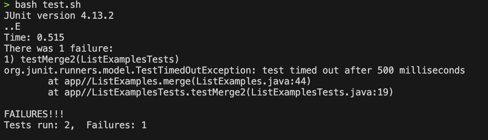

### Christa Tsao
### CSE15L 
### Tue Mar 12 2024

# An Edstem Debugging Scenario...
----------------------------------
### Original Post (Student):
----------------------------------


*Hi, I cannot seem to figure out what is wrong with my code. I ran the testing script and testMerge is failing by timing out. I assume that it is due to some infinite loop, but since there are four loops in the code I cannot identify which of the loops is causing the symptom.*

Here is the original code.


  
----------------------------------
----------------------------------
### TA's Reply:
----------------------------------

Guiding question: 
*In the second screenshot, what does the third while loop do?*

----------------------------------
----------------------------------
### Student's Reply:
(Another screenshot/terminal output showing what information the student got from trying that, and a clear description of what the bug is.)

----------------------------------

*After analyzing the third while loop, I recognized that the index that is being incremented is not corresponsding to the correct list. I changed index1 to index2 and the code now runs correctly.*


----------------------------------
----------------------------------
### Summary
----------------------------------

#### The file & directory structure needed


### The contents of each file before fixing the bug
```test.sh

javac -g -cp .:lib/hamcrest-core-1.3.jar:lib/junit-4.13.2.jar *.java
java -cp .:lib/hamcrest-core-1.3.jar:lib/junit-4.13.2.jar org.junit.runner.JUnitCore ListExamplesTests
```

```ListExamplesTest.java

import static org.junit.Assert.*;
import org.junit.*;
import java.util.*;
import java.util.ArrayList;


public class ListExamplesTests {
	@Test(timeout = 500)
	public void testMerge1() {
    		List<String> l1 = new ArrayList<String>(Arrays.asList("x", "y"));
		List<String> l2 = new ArrayList<String>(Arrays.asList("a", "b"));
		assertArrayEquals(new String[]{ "a", "b", "x", "y"}, ListExamples.merge(l1, l2).toArray());
	}
	
	@Test(timeout = 500)
        public void testMerge2() {
		List<String> l1 = new ArrayList<String>(Arrays.asList("a", "b", "c"));
		List<String> l2 = new ArrayList<String>(Arrays.asList("c", "d", "e"));
		assertArrayEquals(new String[]{ "a", "b", "c", "c", "d", "e" }, ListExamples.merge(l1, l2).toArray());
        }

}
```
```ListExamples.java
import java.util.ArrayList;
import java.util.List;

interface StringChecker { boolean checkString(String s); }

class ListExamples {

  // Returns a new list that has all the elements of the input list for which
  // the StringChecker returns true, and not the elements that return false, in
  // the same order they appeared in the input list;
  static List<String> filter(List<String> list, StringChecker sc) {
    List<String> result = new ArrayList<>();
    for(String s: list) {
      if(sc.checkString(s)) {
        result.add(0, s);
      }
    }
    return result;
  }


  // Takes two sorted list of strings (so "a" appears before "b" and so on),
  // and return a new list that has all the strings in both list in sorted order.
  static List<String> merge(List<String> list1, List<String> list2) {
    List<String> result = new ArrayList<>();
    int index1 = 0, index2 = 0;
    while(index1 < list1.size() && index2 < list2.size()) {
      if(list1.get(index1).compareTo(list2.get(index2)) < 0) {
        result.add(list1.get(index1));
        index1 += 1;
      }
      else {
        result.add(list2.get(index2));
        index2 += 1;
      }
    }
    while(index1 < list1.size()) {
      result.add(list1.get(index1));
      index1 += 1;
    }
    while(index2 < list2.size()) {
      result.add(list2.get(index2));
      index1 += 1;
    }
    return result;
  }


}
```
```StringChecker.class
interface StringChecker {
   boolean checkString(String var1);
}
```

### The full command line (or lines) you ran to trigger the bug
- ```bash test.sh```
### A description of what to edit to fix the bug
- To fix the bug, index1 in ListExamples.java in the third while loop on line 43 needs to be changed to index2.
Fixed Code:

```ListExamples.java
import java.util.ArrayList;
import java.util.List;

interface StringChecker { boolean checkString(String s); }

class ListExamples {

  // Returns a new list that has all the elements of the input list for which
  // the StringChecker returns true, and not the elements that return false, in
  // the same order they appeared in the input list;
  static List<String> filter(List<String> list, StringChecker sc) {
    List<String> result = new ArrayList<>();
    for(String s: list) {
      if(sc.checkString(s)) {
        result.add(0, s);
      }
    }
    return result;
  }


  // Takes two sorted list of strings (so "a" appears before "b" and so on),
  // and return a new list that has all the strings in both list in sorted order.
  static List<String> merge(List<String> list1, List<String> list2) {
    List<String> result = new ArrayList<>();
    int index1 = 0, index2 = 0;
    while(index1 < list1.size() && index2 < list2.size()) {
      if(list1.get(index1).compareTo(list2.get(index2)) < 0) {
        result.add(list1.get(index1));
        index1 += 1;
      }
      else {
        result.add(list2.get(index2));
        index2 += 1;
      }
    }
    while(index1 < list1.size()) {
      result.add(list1.get(index1));
      index1 += 1;
    }
    while(index2 < list2.size()) {
      result.add(list2.get(index2));
      index2 += 1;
    }
    return result;
  }


}
```
------------------------
## Part 2 – Reflection

#### In a couple of sentences, describe something you learned from your lab experience in the second half of this quarter that you didn't know before. It could be a technical topic we addressed specifically, something cool you found out on your own building on labs, something you learned from a tutor or classmate, and so on. It doesn't have to be specifically related to a lab writeup, we just want to hear about cool things you learned!

*I learned more in depth about how to use the terminal, and I think vim was the most helpful to learn. I learned how to generate ssh keys so I don't need to input passwords, and how to create a github pages website, just to name a few of the things. It was a really helpful course overall.*
