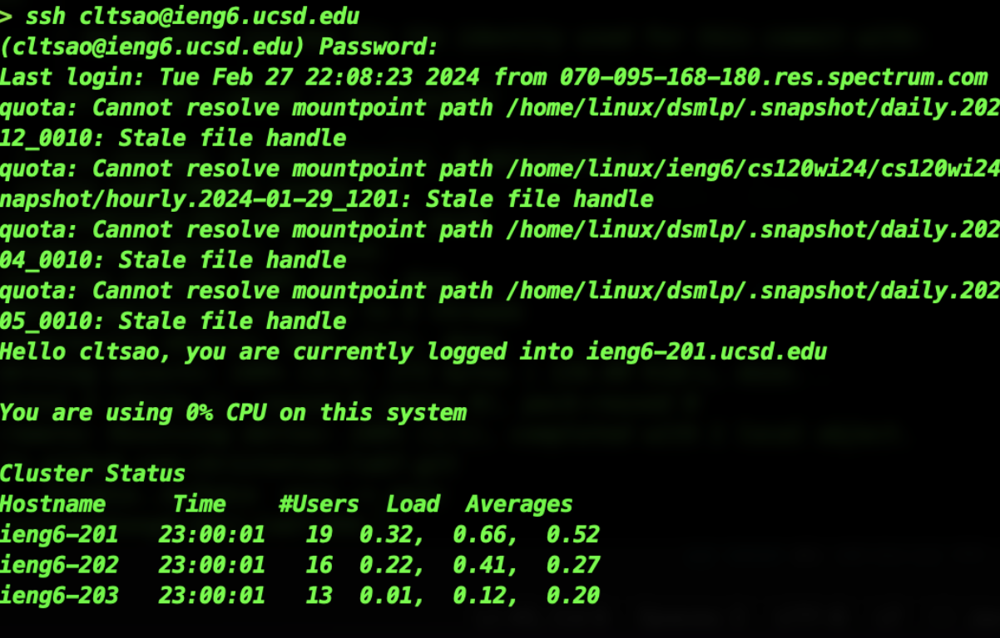
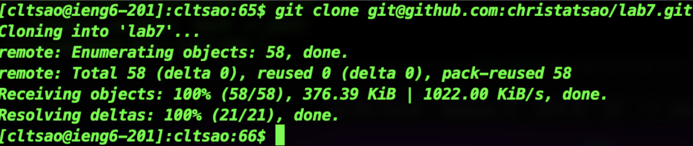
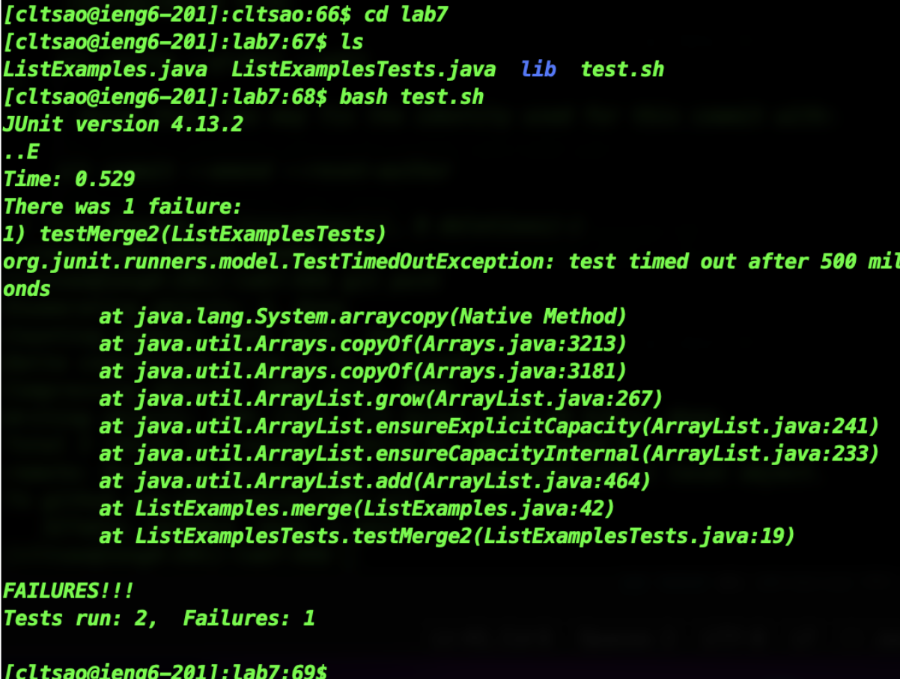
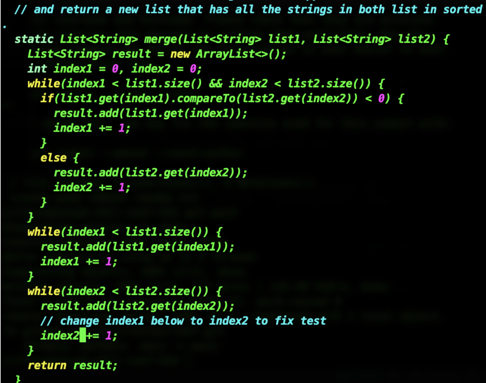
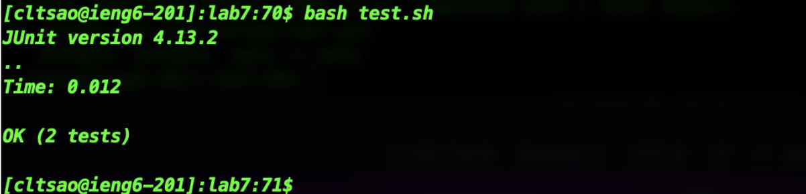
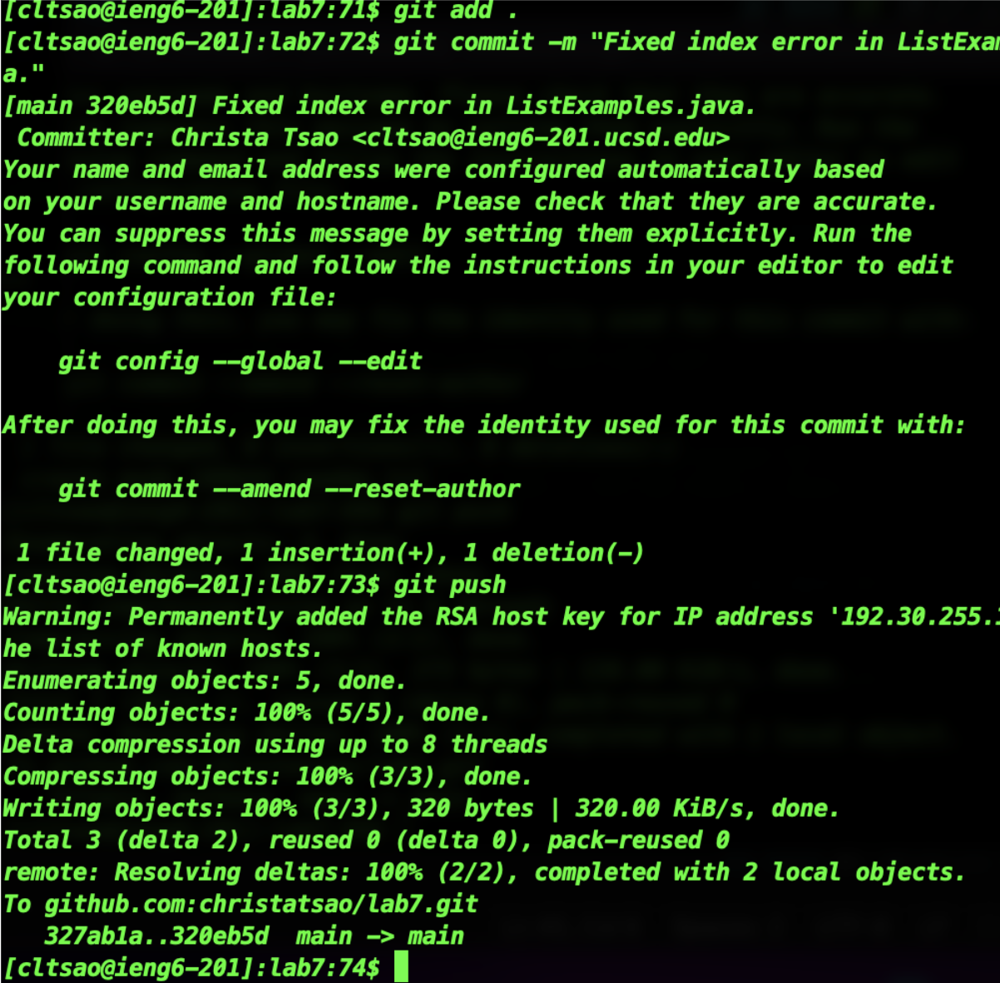

## Christa Tsao

# Step 4:


Here I opened up a new terminal, and typed ```ssh <space> cltsao@i <tab>```. It saves my previous ssh connections so I can autofill with ```<tab>```. Then, since my ssh key connection from week 3 is not working anymore for some reason, I entered my password, then hit ```<enter>```.

-----------------------

# Step 5: 

I pressed ```<Command + V> <enter>``` to paste from my clipboard the gitclone with ssh command copied from the github site.

-----------------------

# Step 6:


I typed and hit the keys in this order:
```cd l <tab><enter>```
```ls```
```bash te <tab><enter>```
I basically just typed the commands using autofill with tab.

-----------------------

# Step 7:


I typed ``` vim ListExamples.java <enter>``` to open up the java file with the vim editor.
```43j``` to go down 43 lines to where the code needed to be changed.
```e``` to go to the last character of the word.
```r2``` to replace the last character with a 2.
```:wq <enter>``` to write the changes and quit.

For most of the vim commands I didn’t need to press enter.

-----------------------

# Step 8:


Keys pressed: ```<up><up><enter>```. The command needed was only 2 up in the command history, so I used up arrow to access it.

-----------------------

# Step 9:


Here, I manually typed in succession:
```git add . <enter>``` to add the current directory.
```git commit -m "Fixed index error in ListExamples.java." <enter>``` to commit the changes with the specified message.
```git push <enter>``` to push the changes.


